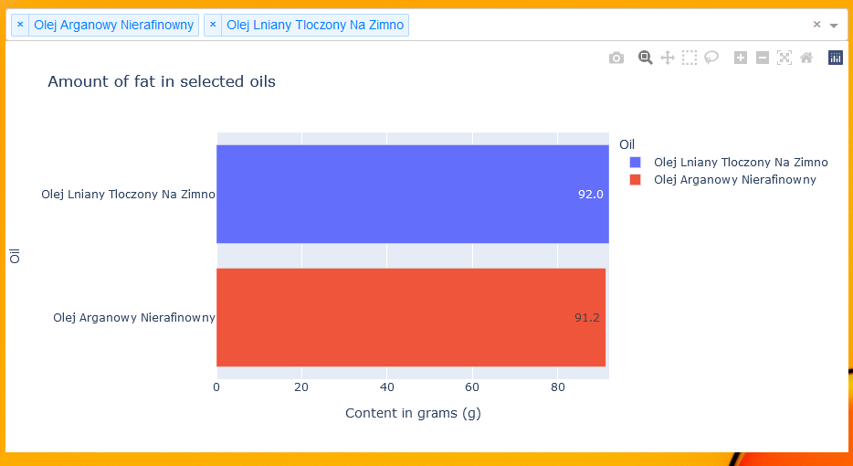
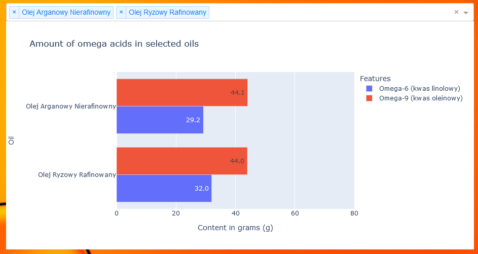
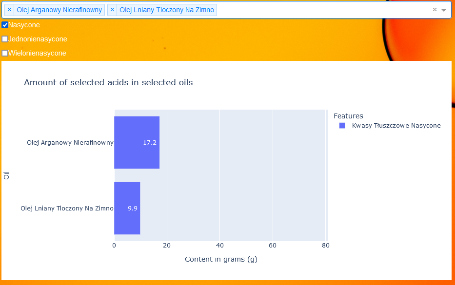

# Oil analysis with plotly graphs

## Assumption of the project
The idea behind this project was the conversation with a family member about usage of oils and their health benefits. I was told that the best option is argan oil. Hearing that I decided to analyze the data on available oils (mainly unrefined) and check if this assumption is true or there could be some better product to buy (taking into consideration amount of saturated/unsaturated fatty acids)

## Steps performed
* Fetching the data (Nutrition facts tables) for all oils sold by a company
* Analyzing and tranforming the data to appropriate format. Once exctracted data is prepared for further usage - saving it to csv
* Creating visualizations for insights (graphs generated in plotly)

## Graphs
1. Check on fat content

2. Check on Omega-3, Omega-6, Omega-9 fatty acids

3. Check on Saturated, Monounsaturated, Polyunsaturated fatty acids

## Technologies
* Python (requests, pandas, BeautifulSoup, plotly)
 
